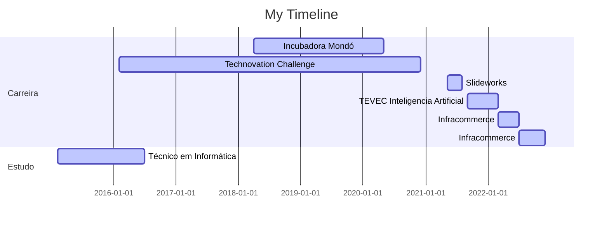

### Oiee👋

- 🎓 Production Engineer
- 👩‍💻 Engenheira de Dados | Gerente de Produto/Projeto
- 📚 IA Student

## Apresentação

Como Engenheira de Dados, adquiri expertise sólida na manipulação de fluxo e volume de dados em processos ETL. Possuo experiência comprovada no uso de tecnologias de Big Data e processamento paralelo distribuído para lidar com grandes volumes de dados de forma eficiente.

Tive a oportunidade de participar ativamente na construção de um framework de plataforma, contribuindo para o desenvolvimento de soluções escaláveis e eficientes. Durante minha carreira, atuei em projetos desafiadores, trabalhando diretamente com clientes no processo de integração e suporte, garantindo o sucesso dos projetos.

Domino uma variedade de recursos e tecnologias relevantes para a área de Engenharia de Dados. Entre eles estão Data-Lakes, Databricks, Apache NiFi, Python e manipulação de repositórios Git. Além disso, tenho conhecimentos em Banco de Dados não relacional. Utilizo uma abordagem ágil em meus projetos, sendo fluente no uso de ferramentas como Jira para gerenciar o fluxo de trabalho de forma eficiente.

Ao longo da minha trajetória, ganhei experiência prática com serviços e soluções em nuvem, com destaque para AWS. Também sou especializada em Hadoop, Spark e Airflow, ferramentas amplamente utilizadas na área de Engenharia de Dados.
Facilidade para atuar e liderar times multidisciplinares.

- Disponível para Mudanças -

  <a href="https://github.com/MariiMartins">
<!--  
 --> 

##

     
   

## 

 
 
  
  
  
  
  
  
  
   

## Atuação profissional

 Empresa | Cargo | Tempo
---|---|---
Infracommerce | Single Point of Contact | 07/2022 - 12/2022
Infracommerce | Data Engineer | 03/2022 - 07/2022
TEVEC Inteligencia Artificial | CX Intern (voltado para Data Science e Data Engineer)| 09/2021 - 02/2022
Slideworks | Product Owner | 05/2021 - 07/2021
Technovation Challenge BR | Mentora-Embaixadora (Voluntário) | 02/2016 - 11/2020
Incubadora Mondó | Analista Eng Produção - Manufatura (experiência academica)| 04/2018 - 04/2020

## 

 Linha do Tempo - TRABALHO/ESTUDO

## Formação Acadêmica

📜 - [Bacharel em Engenharia de Produção - UMESP (2017 - 2022)](https://github.com/MariiMartins/mariimartins/blob/main/doc/ESTUDO%20DO%20OEE%20PARA%20IDENTIFICACAO%20DE%20GARGALOS%20NO%20PROCESSO%20PRODUTIVO.pdf)

💻 - Tecnico em Informática enfase em Gestão de Negócios - EME Prof. Alcina Dantas Feijão (02/2015 - 06/2016)

<!--
**MariiMartins/mariimartins** is a ✨ _special_ ✨ repository because its `README.md` (this file) appears on your GitHub profile.

Here are some ideas to get you started:

- 🔭 I’m currently working on ...
- 🌱 I’m currently learning ...
- 👯 I’m looking to collaborate on ...
- 🤔 I’m looking for help with ...
- 💬 Ask me about ...
- 📫 How to reach me: ...
- 😄 Pronouns: ...
- ⚡ Fun fact: ...
site para icones de tecnologia: https://simpleicons.org/
-->
<!-- Profissional da área de tecnologia, Gerente de Projetos, com aproximadamente 6 anos de experiência em metodologias de projetos ágeis. Participou da implementação do Jira Service Management (Jira Desk) e do Jira Software, no qual, gerenciou processos de produtos e projetos, orçamentos e relacionamento com clientes.

Além disso, como Cientista e Engenheira de Dados, atuou com manipulação de fluxo e volume de dados em ETL, Banco de Dados não relacional (Elasticsearch), uso de tecnologias de big data e processamento paralelo distribuído de grandes volumes de dados. Participou na construção do framework de plataforma, atuou em projetos, tendo interface com clientes em onboarding e sustentação.

Principais recursos e tecnologias trabalhadas: Data-Lakes, Databricks, Apache NiFi, Python, Serverless framework, Manipulação de repositórios Git, Banco de Dados não relacional, Agile, Jira, SFPC, AWS, ETL, Trello, Clickup, Scrum, Kanban, PMO.
-->
 <!--
      
## 
-->
